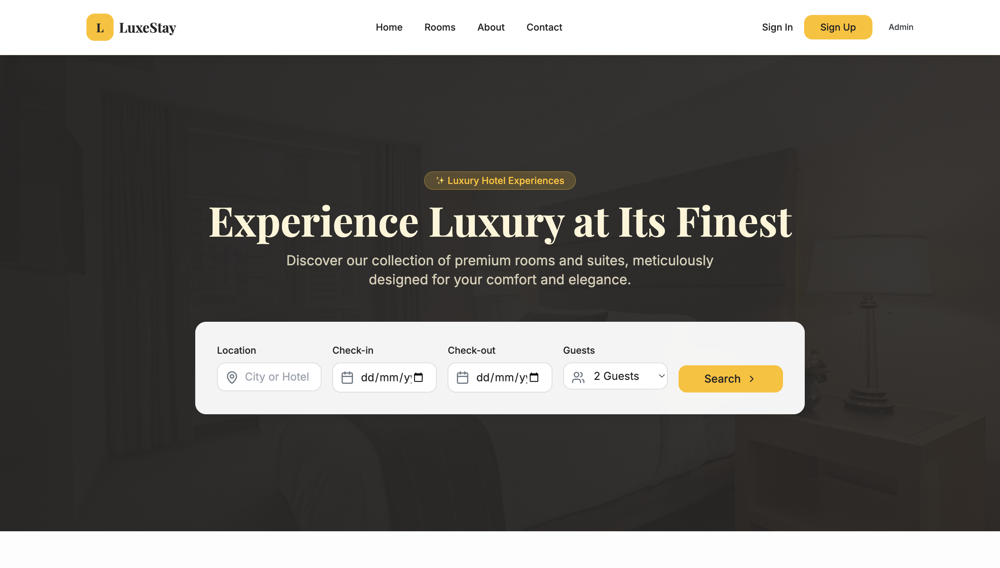
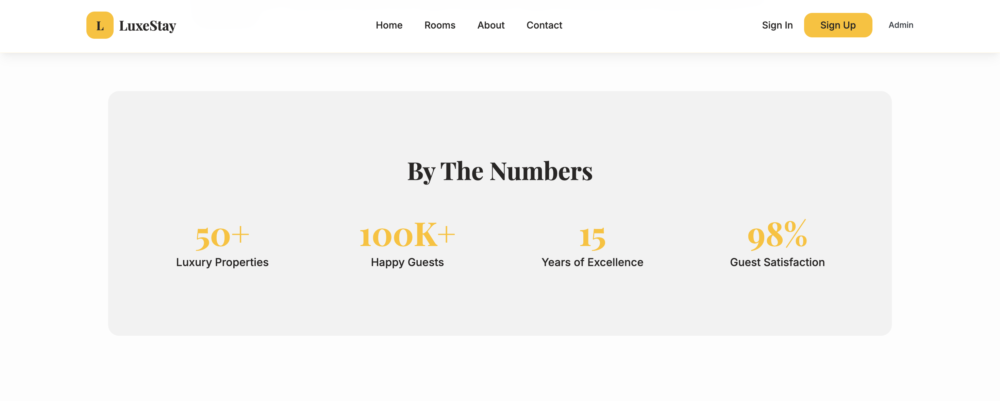
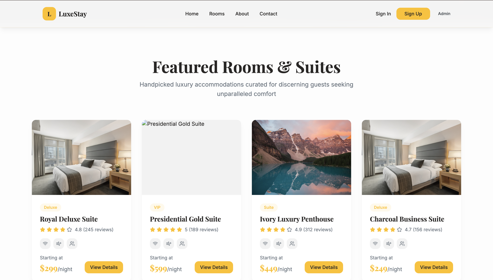
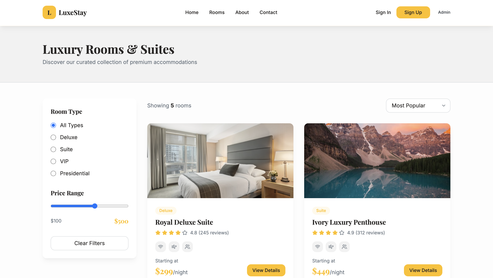
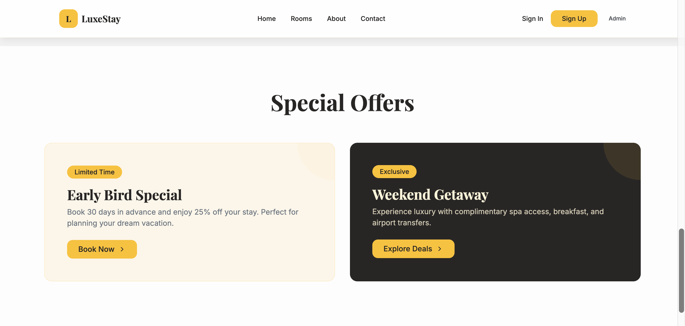
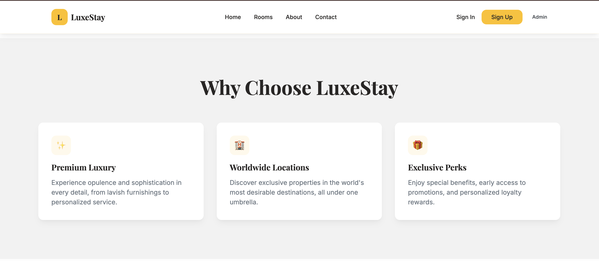
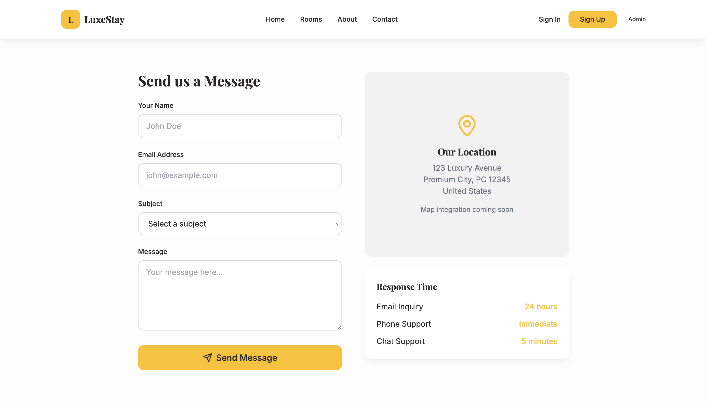

# 🏨 LuxeStay — Luxury Hotel Booking UI (Demo)

**LuxeStay** is a premium luxury hotel booking UI demo inspired by modern 5-star hospitality experiences.  
The project showcases elegant layouts, smooth guest journeys, and admin workflows commonly found in high-end hotel platforms.

Designed with attention to detail, LuxeStay reflects the feel of a real luxury hotel—featuring beautifully crafted home pages, room listings, special offers, and a refined authentication experience for guests and administrators.

This project is **frontend-only**, built for **UI showcases, portfolios, interviews, hackathons, and demos**, with no backend dependencies.

---

## 🏨 Hotel Experience Overview

LuxeStay represents a fictional luxury hotel brand offering:
- Elegant and welcoming home pages
- Premium room showcases with modern aesthetics
- Special offers and featured sections
- Informative About and Contact pages
- Secure and simple guest & admin login experience

The UI is designed to feel **calm, premium, and trustworthy**, similar to real-world luxury hotel booking platforms.

---

## 🖼️ Application Screenshots

---

## ✨ Key Features

- ⚛️ React 18 + TypeScript single-page application  
- ⚡ Vite for fast development and optimized builds  
- 🎨 Tailwind CSS for a luxury, modern UI  
- 🔐 Client-side authentication using localStorage  
- 👥 Guest & Admin user flows  
- 📱 Fully responsive across devices  
- 🚀 Netlify-ready deployment  
- 🧪 Testing support with Vitest  

---

## 🛠 Tech Stack

- **Frontend:** React, TypeScript  
- **Bundler:** Vite  
- **Styling:** Tailwind CSS  
- **Package Manager:** pnpm  
- **Testing:** Vitest  
- **Deployment:** Netlify  

---

### ⚠️ Note
Authentication is implemented only for demo purposes using localStorage.  
Do **not** use this approach in production applications.
